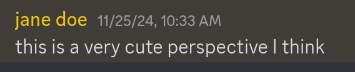

# Notes on combinatorial species (Méndez 2015)

<time datetime="2024-06-08">2024-06-08</time>

In December I got the book *Set Operads in Combinatorics and Computer Science* (Méndez 2015)
from the library.
I didn't read the whole thing, but I'll share some notes I took on the parts that I read.

These will probably be pretty messy, and risk not being super useful,
unless you happen to be unfamiliar with exactly the topics I felt warranted more explanation,
and familiar with exactly the topics I felt could be taken for granted.

## Chapter 1

### 1.1

I didn't find their example of labeled parenthesized words as a set operad particularly
compelling. For one thing, it was difficult to understand that they were considering
$(a(b)c) = (abc)$ but $(a(bc)d) \ne (abcd)$.

I also wonder whether, coming from a CS/PL background, I would find this structure to be a poor
motivator for operads for the same reason that the list monad isn't a good prototypical example for
why we care about monads in Haskell. But I have no idea what e.g. an "IO operad" would look like;
the book isn't focused on this.

## Chapter 2

This chapter introduces combinatorial species.

### 2.1

Their intuition: "a combinatorial species is a class of finite labeled structures that is closed by
relabeling."

More precisely, a combinatorial species is a map $S$ from finite sets to finite sets
(where we denote the image of a set $V$ using square brackets $S[V]$),
along with a map from bijections $V \to U$ to functions $S[V] \to S[U]$
which preserves the identity function and composition.

Using the language of category theory, a species is a functor

$$
\text{core}(\text{FinSet}) \to \text{FinSet}
$$

where $\text{FinSet}$ is the category of finite sets and functions and
$\text{core}(\text{FinSet})$ is the category of
finite sets and only isomorphisms (i.e. bijections).

But actually --- the image of an isomorphism under a functor is always another isomorphism
($F[f]^{-1} = F[f^{-1}]$) so we can instead write:

$$
\text{core}(\text{FinSet}) \to \text{core}(\text{FinSet})
$$

<span class="highlightable" id="species-morphism">
Likewise, a morphism of species is a morphism in the functor category
(i.e. a natural transformation between two functors).
</span>
Best not to get too caught up in the category theory though; the operations on species that we
care about are mostly different from any old functor category.

Last intuition: a species is an arbitrary algebraic data type, like

```
type Foo a = (a, DayOfWeek, a -> Bool)
```

which has the property that `Foo a` is finite whenever `a` is finite.

We don't require that `Foo` be a covariant *or* contravariant functor,
but it does need to be an "invariant functor" ---
[in the Haskell sense](https://hackage.haskell.org/package/invariant)
that given a pair of inverse maps `(a -> b, b -> a)` we can
convert between `Foo a` and `Foo b`.
In other words, it needs to respect isomorphism, as all types should.

An example species:
$\mathcal{G}[V] \triangleq$ the set of undirected unlabeled graphs with vertices
$V$.

We also evaluate species at natural numbers,
so e.g. $S[3]$ means $S[\{1,2,3\}]$.

For any species $R$ and set $A$,
the symmetric group $\mathbb{S}_A$ acts on $R[A]$
via the action of $R$ on morphisms:
$\pi \cdot a \triangleq R[\pi] (a)$.

$\text{core}(\text{FinSet})$ has as its skeleton the discrete category $\mathbb{N}$,
and the cardinality of $R[A]$ is determined by the cardinality of $A$,
so we *could* take sets of numbers as our only labels
and limit our consideration to just the values $R[n]$.
But this makes things uglier.

The *generating function* for a species $R$ is
a formal power series with rational coefficients:

$$
R(x) \triangleq \sum_{n=0}^{\infty} | R[n] | \frac{ x^n }{ n! }
$$

Note the use of parentheses instead of square brackets.

Keep in mind that the generating function doesn't give us a complete picture of a species.
We can exhibit two species which are distinct but have the same generating function.

## Aside: What is a "permutation", anyway?

When I was in grade school I was told that a permutation was a choice of how to arrange the elements of a set.

When I went to university I was told that a permutation is a bijection from a set to itself.

These are basically the same idea, right? After all, there are $n!$ of them either way.

In fact, finite orderings and finite endobijections become equivalent
as soon as you fix an ordering as your "origin."
Then given any *other* ordering you can make a bijection that sends the least
element of the fixed ordering to the least element of the given one, etc.
Another way to say this is that an endobijection is like the difference between two orders.
But since it was arbitrary which fixed ordering we chose to start with,
the isomorphism we obtain this way is also arbitrary.
(This is why it's harder to see the distinction between these notions for sets like
$\{ 1 \dots n \}$ where we have an obvious choice of fixed ordering.)

This is reminiscent of the difference between a point (in an affine space)
and a vector (in a vector space) ---
we get a vector by subtracting two points,
and given any point you can create a coordinate system fixing that point at the origin,
but our choice of origin is arbitrary.

<figure class="smallfigure">
  
</figure>

(Some google suggests what I'm describing is the idea of a [principal homogeneous space](https://en.wikipedia.org/wiki/Principal_homogeneous_space).)

Anyway, working with species gives us a chance to clearly distinguish these two notions of permutation
in our minds - since they yield different ideas of what it means to relabel them.

There is a species $\mathbb{S}$ of permutations:

$$
\begin{align}
\mathbb{S}[V] &\triangleq \mathbb{S}_V = \{ \pi : V \to V \mid \pi \text{ is a bijection} \} \\
\mathbb{S}[f] &\triangleq (\pi \mapsto f \circ \pi \circ f^{-1})
\end{align}
$$

And there is a species $\mathbb{L}$ of orderings a.k.a. lists:

$$
\begin{align}
\mathbb{L}[V] &\triangleq \{ \alpha : \{ 1 \dots n \} \to V \mid \alpha \text{ is a bijection} \} \\
              &\quad \text{ where } n = |V| \\
\mathbb{L}[f] &\triangleq (\alpha \mapsto f \circ \alpha)
\end{align}
$$

These species have the same generating function:

$$
\begin{aligned}
\mathbb{S}(x) &= \sum_{n=0}^{\infty} \left( \frac{ | \mathbb{S}[n] | }{ n! } \right) x^n
               = \sum_{n=0}^{\infty} x^n
\\
\mathbb{L}(x) &= \sum_{n=0}^{\infty} \left( \frac{ | \mathbb{L}[n] | }{ n! } \right) x^n
               = \sum_{n=0}^{\infty} x^n
\end{aligned}
$$

These species are not equivalent even though they have the same cardinalities.
The intuition behind this is that, to relabel a permutation,
we need to *undo* the relabeling on the way in and then do it on the way out,
whereas to relabel a list we only do it on the way out.

In general in mathematics, *automorphisms* (isomorphisms from an object to itself)
capture the idea of a symmetry of a structure.
For example:

- The map that reverses a list defines an automorphism of $\mathbb{L}$ (the species of lists);
- The map that sends a graph to its complement defines an automorphism of $\mathcal{G}$ (the species of graphs).

We also define two *elements* of a species ($r_1 \in R[V], r_2 \in R[W]$)
to be isomorphic if there exists a bijection $f : V \to W$ such that
$R[f] (r_1) = r_2$.

This relation, when restricted to two structures on the same input set $V$,
induces an equivalence relation on $R[V]$ which can be thought of as
erasing labeling information.

This lets us easily see that there is no isomorphism $\mathbb{L} \cong \mathbb{S}$:
there is only one isomorphism class on $\mathbb{L}[V]$,
whereas the isomorphism classes on $\mathbb{S}[V]$ are cycle types.
(The cycle type of a permutation is the multiset of the lengths of the cycles that it factors into.)

## Chapter 3

In general, operations on species are going to be inspired by operations on generating functions.
For example, $0$ and $1$ are species
with generating functions $0$ and $1$ respectively:

$$
\begin{align*}
0[V] &\triangleq \emptyset
\\
1[V] &\triangleq \begin{cases}
  \{ \star \} &\text{ if } V = \emptyset \\
  \emptyset &\text{ otherwise } \end{cases}
\end{align*}
$$

(We use $\{\star\}$ for an arbitrary one-element set.)

The species $X$ has the identity as its generating function:

$$
X[V] \triangleq \begin{cases}
  \{ v \}   &\text{ if } V = \{ v \} \\
  \emptyset &\text{ if } |V| \ne 1
\end{cases}
$$

You might ask why we don't define $X[\{v\}] = \{\star\}$
as with the $1$ species.
The answer is that it's a little nicer to be able to see,
given an element of $X[\{v\}]$, which $v$ was used to build the set ---
especially when we start to build more complicated species.

Finally, the exponential species $E$ is always a singleton:

$$
E[V] \triangleq \{ V \}
$$

(The same reasoning as before applies for why we don't define $E[V] = \{ \star \}$.)
Notice its generating function involves a nice identity from calculus:

$$
\begin{align*}
E(x) &= \sum_{n=0}^{\infty} \left( \frac{ | E[n] | }{ n! } \right) x^n \\
     &= \sum_{n=0}^{\infty} \frac{ x^n }{ n! } \\
     &= \exp(x)
\end{align*}
$$

The book also invites us to consider two different interpretations for $E[V]$:
it can be the species of graphs on $V$ which are *totally connected* (cliques),
or the species of graphs on $V$ which are *totally disconnected*.
Since there's one of each for any $V$, these are all equivalent.
I don't know what the motivations for these interpretations are.

We define a species $R$ to be *connected* if $|R[V]| = 1$
when $|V| = 1$.

For a connected species $R$,
there is a unique
<a href="#species-morphism" class="internal-link">morphism</a>
from $X \to R$ given by:

$$
\begin{align*}
& X_V : X[V] \to R[V] \\
& X_{\{v\}}(v) \triangleq \text{(the single element of R[\{v\}]).}
\end{align*}
$$

### Arithmetic on species

Since generating functions given by power series are summed termwise,
the *sum* of two species is just their pointwise disjoint union:

$$
(S + R)[V] \triangleq S[V] \uplus R[V]
$$

Infinite sums are permitted as long as the sum does not become infinite at any individual point.
For example, if $R$ is a species, we can express it as:

$$
\begin{align*}
R &= \sum_{n = 0}^\infty R_n \\
R_n[V] &\triangleq \begin{cases} R[V] &\text{ if } |V| = n \\ \emptyset &\text{ if } |V| \ne n \end{cases}
\end{align*}
$$

where $R_n$ is the truncation of $R$
to give structure only on sets of cardinality $n$.

We say a species $R$ is *positive* if $R[\emptyset] = \emptyset$,
and denote by $R_+$ the positive species
obtained by truncating of $R$ to only nonempty inputs
(so a species is positive iff $R \cong R_+$).

The *product* of species is the first major place where operations on species start to diverge
from the categorical notions.

The product of two species $R, S$ is a species written $RS$
or $R . S$
whose value on a vertex set $V$ is a set whose elements consist of:

- A choice of partition of $V$ into two disjoint parts $V_1, V_2$;
- an element of $R[V_1]$;
- an element of $S[V_2]$.

This is consistent with a desire to make the generating function of the species
look like the product of the power series:

$$
\begin{align*}
(R . S)(x) &= \sum_{n=0}^\infty \left|(R . S)[n]\right| \frac{x^n}{n!} \\
           &= \sum_{n=0}^\infty \left|\sum_{V_1 \uplus V_2 = \{1 \dots n\} } R[V_1] \times S[V_2] \right| \frac{x^n}{n!} \\
           &= \sum_{n=0}^\infty \left( \sum_{V_1 \uplus V_2 = \{1 \dots n\} } | R[V_1] | \cdot | S[V_2] | \right) \frac{x^n}{n!} \\
           &= \sum_{n=0}^\infty \left( \sum_{n_1 + n_2 = n} { n \choose n_1 } \cdot | R[n_1] | \cdot | S[n_2] | \right) \frac{x^n}{n!} \\
\end{align*}
$$

## More references

- [*Species and Functors and Types, Oh My!*](http://ozark.hendrix.edu/%7Eyorgey/pub/species-pearl.pdf) ---
  a paper about realizing these ideas in the context of Haskell.
- [*Species: making analytic functors practical for functional programming*](https://www.cas.mcmaster.ca/~carette/species/msfp08_species.pdf) ---
  I haven't read this one, but it's on my list.
