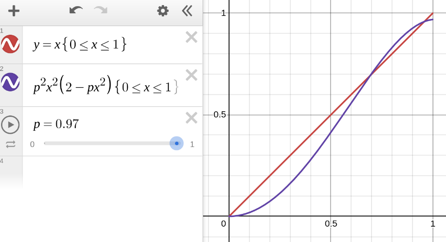

# My solution to "Tree-edge Triage"

<time datetime="2024-11-28">Date: 2024-11-28</time>

Back in September, I found out about the puzzle
["Tree-edge Triage"](https://www.janestreet.com/puzzles/tree-edge-triage-index/).

The problem asks us to consider an infinite binary tree with edges labeled "A" and "B".
The choice is made randomly and independently for each edge,
with the probability of an "A" label being denoted by $p$.

<figure style="width: 50%;">

</figure>

An adversarial game is then played on this tree by two players, Alex and Beth.
Starting with Alex, they take turns stepping downward from the root.
Beth wins if she can ever force an edge labeled by "B" to be crossed.
Conversely, Alex wins if he can continue play forever with both players only crossing "A" edges.
(The image depicts a winning game for Beth.)

We are interested in the circumstances under which Alex has a nonzero probability of winning,
assuming perfect play for both players.
Observe that for $0 < p < 1$, he cannot be guaranteed a win,
since there is a nonzero probability that the first two edges in the tree are labeled "B",
forcing him to make a losing move.

The question posed by the puzzle is to determine the *infimum* of
the set of values of $p$ for which Alex has a nonzero probability of winning.
In other words, we are interested in the *boundary* between
the values of $p$ that are almost surely a win for Beth,
and the values for which Alex has a nonzero chance to win,
regardless of how the boundary value itself is classified.

In notation, we want:

$$
  q = \inf \left\{
    p \in \mathbb{R} \,\middle|\,
    \begin{split}
      & 0 \le p \le 1 \\
      & \mathbb{P} [ \text{Win}(\tau) \mid \tau \sim \text{Trees}_p ] > 0 \\
    \end{split}
  \right\}
$$

where $\tau$ is a tree,
$\text{Win}(\tau)$ is the proposition that
the tree $\tau$ is winnable by Alex playing first,
and $\text{Trees}_p$ is a random variable
ranging over infinite binary trees
where the probability of an "A" label is $p$.

**This concludes my description of the problem.
If you want to work on it yourself, and to avoid spoilers, stop here.**

---
---

## A warm-up &mdash; hopelessness

I'll use variables like $\ell \in \{ \text{A}, \text{B} \}$ to range over labels
and adopt a 2D notation for trees:

$$
  \begin{aligned}
  \tau
  & ::= \left(
    \begin{array}{c}
      \bigcirc \\
      {\scriptstyle \ell_1} \swarrow \quad \searrow {\scriptstyle \ell_2} \\
      \tau_1 \quad \quad \quad \tau_2 \\
    \end{array}
  \right)
  = \left(
    \begin{array}{c}
      \bigcirc \\
      {\scriptstyle (\ell_1, \tau_1)} \quad {\scriptstyle (\ell_2, \tau_2)} \\
    \end{array}
  \right) & \text{(alternative notation)}
  \end{aligned}
$$

Intuitively, Beth has an easier job than Alex &mdash;
she only needs to get lucky once, while her opponent needs to get lucky every time.
My expectation going in was that we should expect $q$ to be close to 1.
The other people I talked to about the problem felt the same way.

In fact, we can relax the problem a bit to get a lower bound on $q$ &mdash;
some trees $\tau$ have the property that
Alex will lose *even with Beth's cooperation*.
This occurs if there are no paths down from the root
that don't eventually pass through a B edge.
We can denote this condition by $\text{Hopeless}(\tau)$
and define it (co)recursively:

$$
  \text{Hopeless}\left(
    \begin{array}{c}
      \bigcirc \\
      {\scriptstyle \ell_1} \swarrow \quad \searrow {\scriptstyle \ell_2} \\
      \tau_1 \quad \quad \quad \tau_2 \\
    \end{array}
  \right)
  \triangleq
  \begin{split}
    & \phantom{...}
    \\
    & ((\ell_1 = \text{B}) \lor \text{Hopeless}(\tau_1))
    \, \land
    \\
    & ((\ell_2 = \text{B}) \lor \text{Hopeless}(\tau_2))
  \end{split}
$$

or, rephrasing in terms of predicates on $(\ell, \tau)$ pairs
(which we'll call *branches*):

$$
\left\{
  \begin{aligned}
  \text{Hopeless} \left(
    \begin{array}{c}
      \bigcirc \\
      {\scriptstyle (\ell_1, \tau_1)} \quad {\scriptstyle (\ell_2, \tau_2)} \\
    \end{array}
  \right)
  & \triangleq \text{H}(\ell_1, \tau_1) \land \text{H}(\ell_2, \tau_2) \\
  \text{H}(\ell, \tau)
  & \triangleq (\ell = \text{B}) \lor \text{Hopeless}(\tau)
  \end{aligned}
\right.
$$

For any tree, the hopelessnesses of its branches are independent from each other;
for any branch, its choice of child is independent from its choice of subtree.
This means we can turn these equations into equations about probabilities:

$$
  \begin{aligned}
  s \triangleq \mathbb{P} [ \text{Hopeless}(\tau) ]
     & = \mathbb{P} [ \text{H}(\ell_1, \tau_1) \land \text{H}(\ell_2, \tau_2) ]
  \\ & = \mathbb{P} [ \text{H}(\ell, \tau) ]^2
  \\     \mathbb{P} [ \text{H}(\ell, \tau) ]
     & = \mathbb{P} [ (\ell = \text{B}) \lor \text{Hopeless}(\tau) ]
  \\ & = 1 - \mathbb{P} [ \ell = \text{A} ] \mathbb{P} [ \neg \text{Hopeless}(\tau) ]
  \\ & = 1 - p (1 - s)
  \end{aligned}
$$

To which the solution is:

$$
  \begin{aligned}
  s &= \left( 1 - \frac{1}{p} \right)^2
  \end{aligned}
$$

This gives us the probability that a random tree is hopeless
when we sample according to $\text{Trees}_p$.

Note in particular that:

- $p \le 1/2 \implies s \ge 1$.
- $\text{Hopeless}(\tau) \implies \neg \text{Win}(\tau)$
  for any tree $\tau$.

So Alex almost surely cannot win when $p \le 1/2$.
This establishes that $q \ge 1/2$.

It also establishes the general techniques we will be using for the full solution:
convert winnability into a predicate on trees,
convert this predicate into a set of equations on probabilities,
and then finally try to solve these equations analytically.

There is a little bit of handwaving involved here &mdash;
to do this rigorously we would need to
stipulate that $\text{Hopeless}$ is
the *minimal* predicate satisfying our definitional equation,
as well as explain why it's okay for $s$ to exceed 1
when it ostensibly represents a probability.
But I'm content with this level of rigor.

## Tackling the original problem

Since the two players take turns moving in this situation,
it makes to define winnability using two mutually recursive predicates.

- Let $W_{\text{A}}(\tau)$
  denote the condition that Alex can win a game
  started at the tree $\tau$ with Alex to play.
- Let $W_{\text{B}}(\tau)$
  denote the condition that Alex can win a game
  started at the tree $\tau$ with Beth to play.

$$
  \left\{
  \begin{aligned}
  W_{\text{A}} \left(
    \begin{array}{c}
      \bigcirc \\
      {\scriptstyle (\ell_1, \tau_1)} \quad {\scriptstyle (\ell_2, \tau_2)} \\
    \end{array}
  \right)
  & \triangleq
  \begin{split}
    & \phantom{...}
    \\
    & ((\ell_1 = \text{A}) \land W_{\text{B}} (\tau_1))
    \, \lor
    \\
    & ((\ell_2 = \text{A}) \land W_{\text{B}} (\tau_2))
  \end{split}
  \\
  W_{\text{B}} \left(
    \begin{array}{c}
      \bigcirc \\
      {\scriptstyle (\ell_1, \tau_1)} \quad {\scriptstyle (\ell_2, \tau_2)} \\
    \end{array}
  \right)
  & \triangleq
  \begin{split}
    & \phantom{...}
    \\
    & ((\ell_1 = \text{A}) \land W_{\text{A}} (\tau_1))
    \, \land
    \\
    & ((\ell_2 = \text{A}) \land W_{\text{A}} (\tau_2))
  \end{split}
  \end{aligned}
  \right.
$$

Notice that the only difference between these predicates is that
the first one is disjunctive in the branches
(since Alex can choose which branch to take)
whereas the second one is conjunctive
(since Alex must assume the branch will be taken adversarially).

Again write this in terms of branches to get:

$$
  \left\{
  \begin{aligned}
    W_{\text{A}} \left(
      \begin{array}{c}
        \bigcirc \\
        {\scriptstyle (\ell_1, \tau_1)} \quad {\scriptstyle (\ell_2, \tau_2)} \\
      \end{array}
    \right)
    & \triangleq H_{\text{B}} (\ell_1, \tau_1) \lor H_{\text{B}} (\ell_2, \tau_2)
    \\
    W_{\text{B}} \left(
      \begin{array}{c}
        \bigcirc \\
        {\scriptstyle (\ell_1, \tau_1)} \quad {\scriptstyle (\ell_2, \tau_2)} \\
      \end{array}
    \right)
    & \triangleq H_{\text{A}} (\ell_1, \tau_1) \land H_{\text{A}} (\ell_2, \tau_2)
    \\
    H_{\text{A}} (\ell, \tau) & \triangleq (\ell = \text{A}) \land W_{\text{A}}(\tau)
    \\
    H_{\text{B}} (\ell, \tau) & \triangleq (\ell = \text{A}) \land W_{\text{B}}(\tau)
  \end{aligned}
  \right.
$$

Now let's attach corresponding probabilities
$w_{\text{A}}, w_{\text{B}}, h_{\text{A}}, h_{\text{B}}$
to these predicates.
We are interested in the values of $p$ for which
$w_{\text{A}} > 0$, but this is
equivalent to
$h_{\text{A}} > 0$,
and it will make the math easier if we focus on that.

$$
  \begin{aligned}
    & \left\{ \begin{aligned}
      w_{\text{A}} &= 1 - (1 - h_{\text{B}})^2 \\
      w_{\text{B}} &= h_{\text{A}}^2 \\
      h_{\text{A}} &= p w_{\text{A}} \\
      h_{\text{B}} &= p w_{\text{B}} \\
    \end{aligned} \right.
    \\ \iff &
    \left\{ \begin{aligned}
      h_{\text{A}} &= p h_{\text{B}} (2 - h_{\text{B}}) \\
      h_{\text{B}} &= p h_{\text{A}}^2 \\
    \end{aligned} \right.
    \\ \iff &
    \quad
    h_{\text{A}} = p^2 h_{\text{A}}^2 (2 - p h_{\text{A}}^2)
    \\ \iff &
    \quad
      h_{\text{A}} \text{ is a fixed point of the map }
    \\ & \quad
      f_p : x \mapsto p^2 x^2 (2 - p x^2).
  \end{aligned}
$$

The last step here might seem redundant,
but talking about fixed points hints at the idea that
we might be able to better understand the problem by
understanding the dynamics of the map $f_p$.
On its own, trying to solve the equation
$x = p^2 x^2 (2 - p x^2)$
analytically for arbitrary $p$ isn't promising.
We can get the solution $x = 0$,
but then we're left with an ugly cubic.

Remember, though, that we aren't really looking to compute
the fixed points of $f_p$ for arbitrary $p$
but rather to find a boundary value of $p$
with regards to the fixed point behavior of the map.

Inspecting the graph visually, we can see that when
$p$ is sufficiently high, there are three fixed points:
a stable fixed point at $x = 0$,
an unstable fixed point $\left( |f_p'(x)| > 1 \right)$ to its right,
and a stable fixed point $\left( |f_p'(x)| < 1 \right)$ further to the right of that.

<figure>
  
  <figcaption>
    Graph of the map $f_p$ (purple)
    compared against the identity map (red)
    with $p = 0.97$.
  </figcaption>
</figure>

On the other hand, for smaller values of $p$
there are no fixed points except at 0.

<figure>
  
  <figcaption>
    Graph of the map $f_p$ (purple)
    compared against the identity map (red)
    with $p = 0.90$.
  </figcaption>
</figure>

So we should expect that at the boundary value,
the two fixed points merge into a semi-stable fixed point
at which the graph is tangent to the $y = x$ line:

<figure>
  
  <figcaption>
    Graph of the map $f_p$ (purple)
    compared against the identity map (red)
    with $p = q$.
  </figcaption>
</figure>

In other words, we have that $f_q$ has a fixed point
$0 < x < 1$ satisfying:

$$
  \begin{aligned}
  &
  \left\{ \begin{aligned}
    x &= f(x) \\
    1 &= f'(x) \\
  \end{aligned} \right.
  \\ \implies &
  \left\{ \begin{aligned}
    x &= q^2 x^2 (2 - q x^2) \\
    1 &= q^2 (2 x (2 - q x^2) + x^2 (-2p x)) \\
      &= q^2 (4 x - 2 q x^3 - 2 q x^3) \\
      &= 4 q^2 x (1 - q x^2) \\
  \end{aligned} \right.
  \\ \implies &
  \left\{ \begin{aligned}
    1 &= q^2 x (2 - q x^2) \\
    1 &= 4 q^2 x (1 - q x^2) \\
  \end{aligned} \right.
  \\ \implies &
    q^2 x (2 - q x^2)
    = 4 q^2 x (1 - q x^2)
  \\ \implies &
    (2 - q x^2)
    = 4 (1 - q x^2)
  \\ \implies &
    \left\{ \begin{aligned}
      \frac{2}{3} &= q x^2 \\
      x &= q (q x^2) (2 - q x^2) \\
        &= q \left( \frac{2}{3} \right) \left( 2 - \frac{2}{3} \right) \\
        &= \frac{8}{3} q
    \end{aligned} \right.
  \\ \implies &
  \quad q = \frac{3}{4} \sqrt[3]{2}.
  \end{aligned}
$$

So we have $q \approx 0.94494$.

## Conclusion

That was a fun puzzle!
